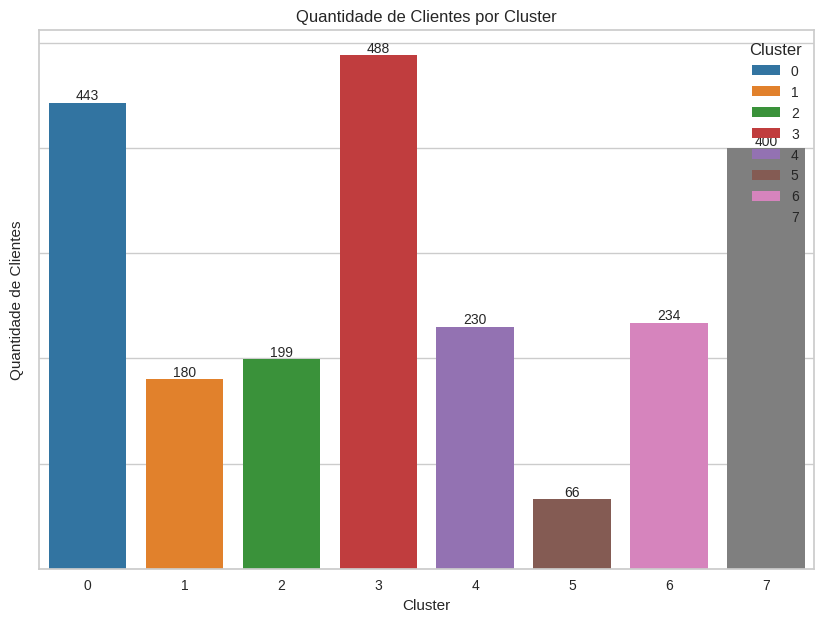
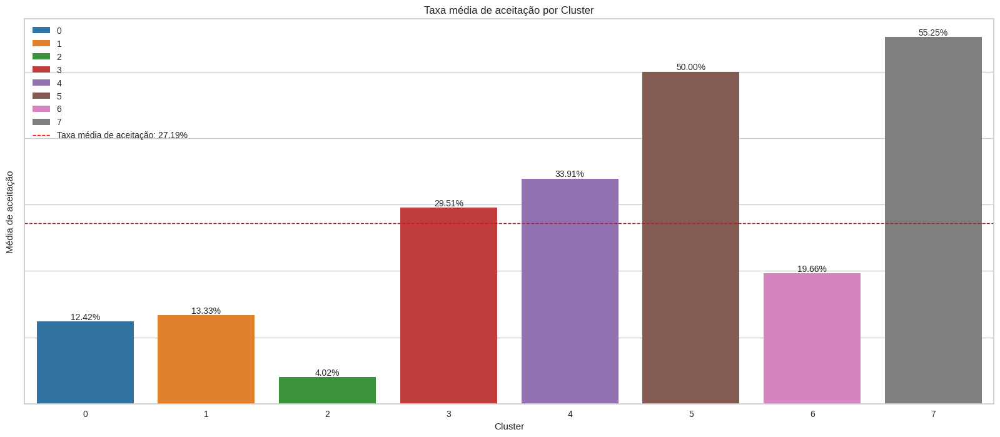
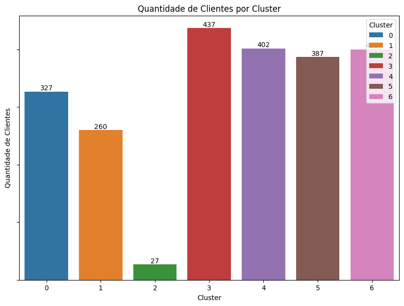
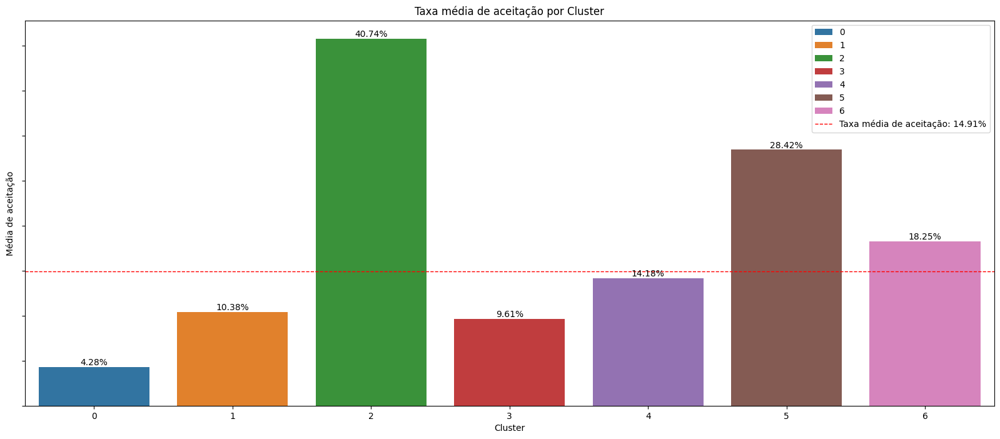
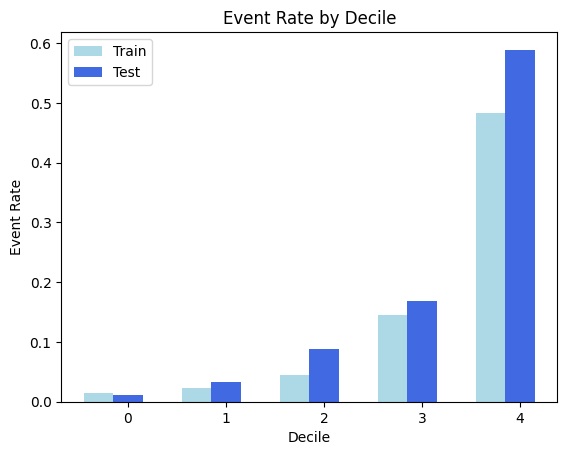
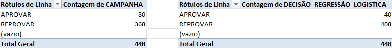

### Projeto para o CRM

Aplicando a abordagem CRISP-DM:

## Entendimento do Negócio

A RetaiX é uma empresa voltada ao varejo, com um grande número de clientes e diversas campanhas de marketing ativas. A empresa enfrenta desafios relacionados ao engajamento de clientes e à eficácia das campanhas, que podem estar resultando em um retorno sobre investimento (ROI) abaixo do esperado. Os principais problemas identificados incluem:

- **Baixa Retenção de Clientes**: Uma parte significativa dos clientes realiza poucas compras, o que indica uma necessidade de melhorar a fidelização. A baixa retenção pode impactar negativamente a receita e exigir investimentos constantes em aquisições de novos clientes.

- **Custos com Campanhas de Marketing**: Manter campanhas de marketing eficazes requer um investimento contínuo. No entanto, campanhas genéricas podem não atingir o público-alvo de forma eficiente, resultando em desperdício de recursos.

- **Personalização Limitada**: A falta de segmentação detalhada dos clientes impede a personalização das ofertas e comunicações. Isso pode levar a um engajamento reduzido, uma vez que os clientes não se sentem valorizados ou compreendidos pela marca.

## Entendimento dos Dados

Foi realizada uma análise dos dados fornecidos pela empresa, considerando dois cenários: o primeiro aborda a aceitação de qualquer campanha, enquanto o segundo foca na aceitação com base na última campanha.

- **Base de Clientes**: A análise foi realizada com uma base de 2.240 clientes.

- **Taxa de Aceitação**:
  - No cenário 1, a taxa de aceitação é de 27,19%.
  - No cenário 2, a taxa de aceitação é de 14,91%.

- **Renda**:
  - A renda familiar anual média da base de clientes é de 52.247 unidades monetárias, com mais da metade dos clientes apresentando essa renda ou um valor inferior.
  - No cenário 1, a maior taxa de aceitação ocorre entre clientes com renda acima da média, especificamente entre 68.223 e 134.717 unidades monetárias, com uma taxa de 49,46%.
  - No cenário 2, observa-se o mesmo padrão, porém a taxa de aceitação para essa faixa de renda é de 27,08%.

- **Nível de Educação**:
  - Cerca de 88,53% dos clientes possuem um nível de educação igual ou superior a uma graduação.
  - No cenário 1, a única faixa de educação com taxa de aceitação superior à média geral é a de clientes com doutorado, com uma taxa de 32,51%.
  - No cenário 2, tanto clientes com doutorado (20,78%) quanto com mestrado (15,41%) apresentam taxas de aceitação acima da média geral.

- **Estado Civil**:
  - A maioria dos clientes está casada ou em união estável, sendo os solteiros o terceiro maior grupo.
  - No cenário 1, apenas o grupo de clientes casados ou em união estável apresenta uma taxa de aceitação abaixo da média de 27,19%. Todos os outros grupos superam essa taxa.
  - No cenário 2, o padrão se repete, com uma média de aceitação geral de 14,91%.

## Preparação dos Dados

A empresa forneceu conjuntos de dados com informações dos clientes. A preparação dos dados foi realizada em duas etapas principais: uma voltada para a clusterização e outra para a modelagem preditiva.

### Etapa de Clusterização

1. **Criação e Pré-processamento das Variáveis**:
   - **Criação de Variáveis**: Foram geradas variáveis adicionais que poderiam auxiliar na clusterização.
   - **Divisão das Variáveis**: Separação das variáveis em categóricas e numéricas.
   - **Pipeline para Dados Categóricos**:
     - Imputação dos valores ausentes utilizando o valor mais frequente.
     - Codificação One-Hot para as variáveis categóricas.
   - **Pipeline para Dados Numéricos**:
     - Imputação dos valores ausentes com a média.
     - Normalização dos dados utilizando Robust Scaler.
   - **Transformação**: Aplicação dos pipelines e combinação dos dados pré-processados.

2. **Redução de Dimensionalidade**:
   - **PCA**: Aplicação da Análise de Componentes Principais (PCA) para reduzir a dimensionalidade dos dados.

### Etapa Preditiva

1. **Preparação dos Dados**:
   - **Imputação**: Preenchimento de valores faltantes utilizando a mediana para variáveis numéricas e o valor mais frequente para variáveis categóricas.
   - **Codificação de Variáveis Categóricas**: Aplicação de target encoding para as variáveis categóricas.
   - **Remoção de Variáveis**:
     - **Zero Variância**: Exclusão de variáveis que não apresentavam variação.
     - **Variáveis Correlacionadas**: Exclusão de variáveis com correlação maior que 0,875.

2. **Seleção de Variáveis**:
   - **XGBoost**: Utilização do modelo XGBoost para determinar a importância das variáveis e selecionar as mais relevantes para o modelo preditivo.

## Modelagem

### Etapa de Clusterização

1. **Avaliação do Número de Clusters**:
   - **Método da Silhueta**: Calculou-se a pontuação da silhueta para diferentes números de clusters (entre 2 e 10) para avaliar a qualidade dos agrupamentos.
   - **Método do Cotovelo (Elbow Method)**: Utilizou-se o `KElbowVisualizer` para determinar o número ideal de clusters com base em métricas como silhueta e variância explicada.

2. **Modelo de Mistura Gaussiana (GMM)**:
   - **Seleção do Número de Componentes**: Avaliou-se o número ideal de componentes com base nos critérios AIC (Critério de Informação de Akaike) e BIC (Critério de Informação Bayesiano). A configuração com menor BIC foi escolhida.
   - **Treinamento e Avaliação**: O modelo GMM foi treinado e ajustado para encontrar a configuração ótima. No primeiro cenário, o modelo com 8 componentes e covariância 'full' foi selecionado; no segundo cenário, o modelo com 7 componentes e covariância 'full' foi o escolhido.

3. **Resultados**:
   - **Atribuição de Clusters**: Os clusters foram atribuídos aos dados, e a coluna 'Cluster' foi adicionada ao DataFrame `df_publico` com as etiquetas correspondentes.

Os modelos K-means e GMM foram comparados, sendo o modelo de mistura gaussiana escolhido como o melhor para a clusterização.

### Etapa Preditiva

1. **Verificação de Linearidade**:
   - **Teste de Linearidade**: Verificou-se se a relação entre as variáveis independentes e o log das odds da variável dependente era linear, identificando variáveis que precisavam de transformações para satisfazer os pressupostos do modelo de regressão logística.

2. **Transformação de Variáveis**:
   - **Aplicação de Transformações**: Utilizou-se a função `apply_best_transformations` para aplicar transformações logarítmicas e quadráticas conforme necessário, com base na análise.

3. **Categorização com Árvore de Decisão**:
   - **Análise de Variáveis**: Foi utilizado o `DecisionTreeClassifier` para categorizar variáveis contínuas e categóricas em classes com base em pontos de corte identificados pela árvore de decisão, facilitando o processo de codificação One-Hot.

4. **One-Hot Encoding**:
   - **Instanciação do Encoder**: Utilizou-se o `OneHotEncoder` da `sklearn` para transformar variáveis categóricas em binárias.
   - **Transformação dos Dados**: O encoder foi ajustado e aplicado aos dados de treino e teste, sendo as colunas categóricas originais removidas.

5. **Regressão Logística**:
   - **Treinamento do Modelo**: Ajustou-se o modelo de regressão logística utilizando o `Logit` da `statsmodels`, coletando os coeficientes, p-valores e estatísticas de Wald.
   - **Seleção de Variáveis**: Com base nos p-valores, selecionaram-se variáveis significativas (p ≤ 0.05) para o modelo final.

6. **Avaliação do Modelo**:
   - **Cálculo de Métricas**: Foram calculadas as métricas KS, AUC e Gini para os dados de treino e teste, avaliando a performance do modelo.

## Avaliação

A seguir, é apresentada a avaliação dos modelos de clusterização e do modelo preditivo.

### Clusterização

- **Cenário 1**:
  
  O público foi dividido em 8 clusters, com a seguinte distribuição:

  

  Os resultados iniciais da clusterização são mostrados a seguir:

  

  **Observações**:
  - **Clusters com Maior Aceitação**:
    - **Cluster 3**: 29,51%
    - **Cluster 4**: 33,91%
    - **Cluster 7**: 56,25%

- **Cenário 2**:
  
  O público foi dividido em 7 clusters, com a seguinte distribuição:

  

  Os resultados iniciais da clusterização são apresentados abaixo:

  

  **Observações**:
  - **Clusters com Maior Aceitação**:
    - **Cluster 5**: 28,42%
    - **Cluster 6**: 18,25%

### Etapa Preditiva

Na etapa preditiva, optamos por desenvolver o modelo com base no estudo da última campanha, com o objetivo de melhorar o CRM. Para avaliação, realizamos a ordenação da regressão logística em 5 faixas (decil):

As métricas de desempenho para o modelo de regressão logística são:

| Métrica | Valor de Treinamento | Valor de Teste |
|---------|-----------------------|----------------|
| KS      | 0,617050              | 0,621196       |
| AUC     | 0,875371              | 0,874541       |
| Gini    | 0,750742              | 0,749083       |

Distribuição do público nos deciles durante as etapas de teste:

| Faixa | Pontuação Mínima | Pontuação Máxima | Taxa de Evento | Volume |
|-------|------------------|------------------|----------------|--------|
| 0     | 0,0010           | 0,0149           | 0,011111       | 90     |
| 1     | 0,0153           | 0,0369           | 0,033708       | 89     |
| 2     | 0,0372           | 0,0794           | 0,088889       | 90     |
| 3     | 0,0822           | 0,1956           | 0,168539       | 89     |
| 4     | 0,2042           | 0,9834           | 0,588889       | 90     |

Após a avaliação, as seguintes etapas foram realizadas:

1. **Análise Aprofundada dos Clusters**: Foi elaborado um estudo detalhado sobre os clusters identificados em cada cenário, que foi enviado ao time de negócios. Este estudo abrange uma análise minuciosa das características de cada cluster, além de recomendações específicas para ações com base nos perfis encontrados.

2. **Estudo da Base de Teste**: Realizamos um estudo utilizando 20% da nossa base de clientes, correspondente à nossa fase preditiva.

   - Neste estudo, comparamos a taxa de aceitação da base com os scores do nosso modelo. Os clientes com um score superior a 0,5 foram considerados para o envio da campanha.
   - A base de testes consistiu em 448 clientes; dentre estes, apenas 80 aceitaram a campanha. Com nosso modelo, teríamos enviado a campanha a apenas 40 clientes.
   - Essa abordagem resultou em uma redução superior a 90% nos gastos com o envio de campanhas. No entanto, será necessário realizar um estudo adicional, pois não dispomos dos custos de envio nem do valor gasto pelos clientes que aceitaram a campanha para uma mensuração precisa.

## Próximas Etapas

1. **Estudo de Custos**: Como mencionado anteriormente, a equipe de negócios deve realizar um estudo para avaliar os custos associados à redução do número de clientes a serem incluídos na campanha, bem como o valor gasto pelos clientes que aceitarem a oferta.

Após essa análise, iremos revisar a implementação do modelo apresentado e trabalhar para otimizar ao máximo as métricas de CRM.
