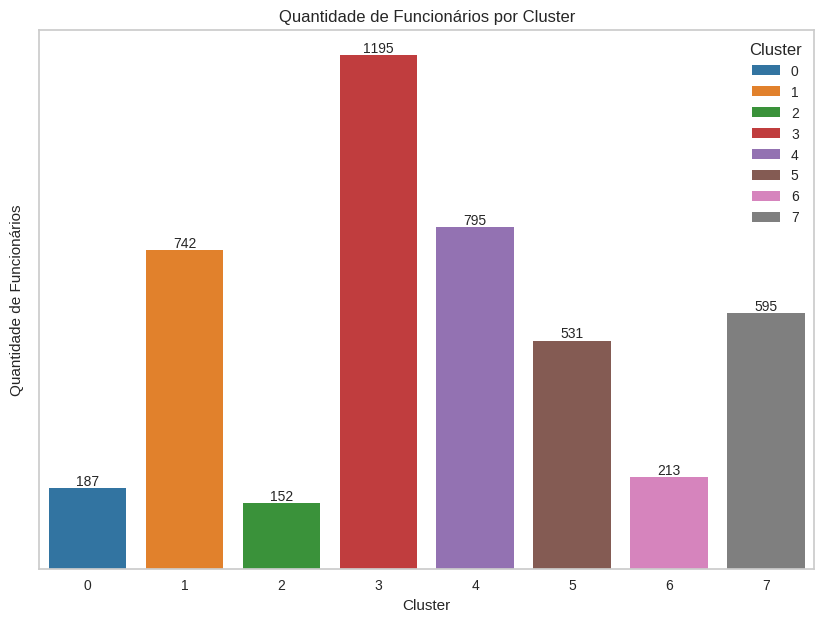
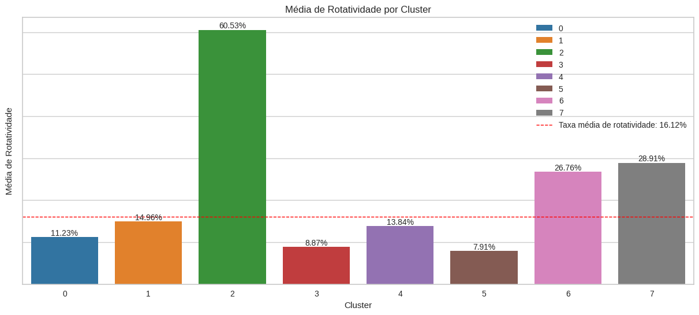
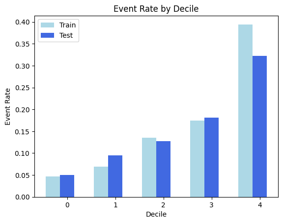

### Projeto para o RH

Aplicando a abordagem CRISP-DM:

## Entendimento do Negócio

A RetaiX é uma empresa com aproximadamente 4000 funcionários. Anualmente, cerca de 15% de sua força de trabalho deixa a empresa, resultando em uma alta taxa de rotatividade. A gestão acredita que essa rotatividade elevada tem várias implicações negativas para a organização, incluindo:

- **Impacto na Operação e Reputação**: A saída frequente de funcionários pode dificultar o cumprimento de prazos, o que afeta negativamente a reputação da empresa entre consumidores e parceiros.
- **Custos de Recrutamento**: Manter um departamento dedicado ao recrutamento e seleção é necessário para encontrar novos talentos, o que pode aumentar os custos operacionais.
- **Necessidade de Treinamento**: Novos funcionários geralmente requerem treinamento e tempo para se adaptar à cultura e aos processos da empresa, o que pode impactar a produtividade no curto prazo.

## Entendimento dos Dados

Foi realizada uma anaálise nos dados fornecidos pela empresa e identificamos as seguintes informações:

- **Taxa de Rotatividade**: A taxa de rotatividade na base é de 16,12%, ligeiramente superior aos 15% relatados pela empresa.
- **Faixas Etárias**:
  - Idade mínima: 18 anos; idade máxima: 60 anos.
  - Maiores concentrações de funcionários nas faixas etárias de 30-34 e 34-39 anos.
  - A maior taxa de rotatividade ocorre na faixa etária de 18 a 22 anos, com taxas elevadas também para a faixa de 18 a 34 anos. A rotatividade diminui nas faixas de 34 a 55 anos e aumenta novamente para 55 a 60 anos.

- **Gênero**:
  - 60% dos funcionários são do gênero masculino e 40% do gênero feminino.
  - A taxa de rotatividade é ligeiramente maior entre os funcionários masculinos.

- **Funções**:
  - As funções que concentram quase 60% dos funcionários são Executivo de Vendas, Cientista de Pesquisa e Técnico de Laboratório.
  - A função com maior taxa de rotatividade é Diretor de Pesquisa, enquanto Diretor de Manufatura tem a menor taxa de rotatividade.

- **Renda Mensal**:
  - 68% dos funcionários têm uma renda mensal de até 13.412 rúpias.
  - Não há uma relação monotônica entre faixa de renda e taxa de rotatividade. A faixa de 28.604 a 32.402 rúpias, que representa apenas 1,2% dos funcionários, apresenta uma taxa de rotatividade significativamente mais alta.

## Preparação dos Dados

A empresa forneceu datasets contendo informações dos funcionários, incluindo dados de satisfação e feedback dos gestores. A preparação dos dados foi realizada em duas etapas principais: uma para clusterização e outra para modelagem.

### Etapa de Clusterização

1. **Criação e Pré-processamento das Variáveis**:
   - **Criação de Variáveis**: Geração de variáveis adicionais que poderiam auxiliar na clusterização.
   - **Divisão das Variáveis**: Separação das variáveis categóricas e numéricas.
   - **Pipeline para Dados Categóricos**:
     - Imputação dos valores ausentes com a estratégia de valor mais frequente.
     - Codificação One-Hot para variáveis categóricas.
   - **Pipeline para Dados Numéricos**:
     - Imputação dos valores ausentes com a mediana.
     - Escalonamento Robusto para normalização dos dados.
   - **Transformação**: Aplicação dos pipelines e combinação dos dados pré-processados.

2. **Redução de Dimensionalidade**:
   - **PCA**: Aplicação da Análise de Componentes Principais (PCA) para reduzir a dimensionalidade dos dados, mantendo 75% da variância explicada.

### Etapa Preditiva

1. **Preparação dos Dados**:
   - **Imputação**: Preenchimento de valores faltantes usando mediana para variáveis numéricas e valor mais frequente para variáveis categóricas.
   - **Codificação de Variáveis Categóricas**: Aplicação de codificação target para variáveis categóricas.
   - **Remoção de Variáveis**:
     - **Zero Variância**: Exclusão de variáveis sem variação.
     - **Variáveis Correlacionadas**: Exclusão de variáveis altamente correlacionadas (correlação > 0.75).

2. **Seleção de Variáveis**:
   - **XGBoost**: Utilização do modelo XGBoost para determinar a importância das variáveis e selecionar as mais relevantes para o modelo preditivo.

## Modelagem

## Etapa de Clusterização

1. **Avaliação do Número de Clusters**:
   - **Método da Silhueta**: Cálculo da pontuação da silhueta para diferentes números de clusters (entre 2 e 10) para avaliar a qualidade dos clusters formados.
   - **Método do Cotovelo (Elbow Method)**: Utilização do `KElbowVisualizer` para determinar o número ideal de clusters baseado em métricas como a silhueta e a variância explicada.

2. **Algoritmo K-means**:
   - **Treinamento e Avaliação**: Treinamento do modelo K-means com diferentes números de clusters. A análise revelou que 3 clusters era uma boa escolha com base na pontuação da silhueta e na visualização do método do cotovelo.

3. **Modelo de Mistura Gaussiana (GMM)**:
   - **Seleção do Número de Componentes**: Avaliação do número ideal de componentes usando critérios como AIC (Critério de Informação de Akaike) e BIC (Critério de Informação Bayesiano). A configuração com menor BIC foi selecionada.
   - **Treinamento e Avaliação**: O modelo GMM foi treinado e ajustado para encontrar a configuração ótima. O modelo de mistura gaussiana com 8 componentes e tipo de covariância 'full' foi escolhido como o modelo final.

4. **Resultados**:
   - **Atribuição de Clusters**: Atribuição dos clusters aos dados e atualização do DataFrame `df_publico` com a coluna 'Cluster' contendo as etiquetas dos clusters.

Os modelos de K-means e GMM foram comparados, e o modelo de mistura gaussiana foi selecionado como o modelo final para a clusterização dos dados.

## Etapa Preditiva

1. **Verificação de Linearidade**:
   - **Teste de Linearidade**: Foi verificado se a relação entre as variáveis independentes e o log da odds da variável dependente era linear. Essa verificação ajudou a identificar quais variáveis precisavam ser transformadas para atender aos pressupostos do modelo de regressão logística.

2. **Transformação de Variáveis**:
   - **Aplicação de Transformações**: Utilizou-se a função `apply_best_transformations` para aplicar transformações logarítmicas e quadráticas às variáveis, conforme definido nos resultados da análise.

3. **Categorização com Árvore de Decisão**:
   - **Análise de Variáveis**: Foi utilizado o `DecisionTreeClassifier` para categorizar variáveis contínuas e variáveis categóricas em categorias baseadas em pontos de corte identificados pela árvore de decisão. Essa abordagem ajudou a transformar essas variáveis em categorias que facilitam o processo de One-Hot Encoding.

4. **One-Hot Encoding**:
   - **Instanciação do Encoder**: Foi utilizado o `OneHotEncoder` da `sklearn` para transformar variáveis categóricas em variáveis binárias.
   - **Transformação dos Dados**: O encoder foi ajustado e aplicado aos dados de treino e teste. Os dados codificados foram então combinados com os dados originais, removendo as colunas categóricas originais.

5. **Regressão Logística**:
   - **Treinamento do Modelo**: Utilizou-se o `Logit` da `statsmodels` para ajustar o modelo de regressão logística. O modelo foi ajustado com uma constante e os coeficientes, p-valores e estatísticas de Wald foram coletados.
   - **Seleção de Variáveis**: Baseado nos p-valores, variáveis significativas foram selecionadas para a análise final. As variáveis com p-valor menor ou igual a 0.05 foram utilizadas no modelo final.

6. **Avaliação do Modelo**:
   - **Cálculo de Métricas**: Foi calculado o KS, AUC e Gini para os dados de treino e teste. A métrica KS, AUC e Gini foram calculadas para avaliar a performance do modelo.

## Avaliação

A seguir, apresentamos a avaliação dos modelos de Clusterização e Preditivo.

### Clusterização

Dividimos nosso público em 8 clusters, resultando na seguinte distribuição:

Os resultados iniciais da clusterização são:

Observações:
- **Clusters com Maior Rotatividade**:
  - **Cluster 2**: 60,5%
  - **Cluster 6**: 26,8%
  - **Cluster 7**: 28,9%
- **Clusters com Menor Rotatividade**:
  - Todos os clusters, exceto os mencionados, apresentam uma taxa de rotatividade menor do que a média da empresa.
  - **Cluster 5**: Possui o menor percentual de rotatividade dentre todos os clusters.

### Etapa Preditiva

Na etapa preditiva, optamos por ordenar a regressão logística em 5 faixas (decil):

As métricas de desempenho para o modelo de regressão logística são:

| Métrica | Valor de Treinamento | Valor de Teste |
|---------|-----------------------|----------------|
| KS      | 0,362632              | 0,300900       |
| AUC     | 0,749186              | 0,710021       |
| Gini    | 0,498371              | 0,420042       |

Distribuição do público nos deciles durante as etapas de teste:

| Faixa | Pontuação Mínima | Pontuação Máxima | Taxa de Evento | Volume |
|-------|------------------|------------------|----------------|--------|
| 0     | 0,0000           | 0,0069           | 0,049550       | 222    |
| 1     | 0,0476           | 0,0779           | 0,095023       | 221    |
| 2     | 0,0790           | 0,1206           | 0,127854       | 219    |
| 3     | 0,1225           | 0,1982           | 0,180995       | 221    |
| 4     | 0,1993           | 0,8188           | 0,322727       | 220    |

Após a avaliação, foram realizadas as seguintes etapas:

1. **Estudo Detalhado dos Clusters**: Foi enviado para o time de negócio um estudo mais detalhado sobre os clusters identificados. Esse estudo inclui uma análise aprofundada das características de cada cluster e recomendações para ações específicas com base nos perfis encontrados.

2. **Identificação do Público**: Foi realizada uma maior identificação do público dentro dos clusters para entender melhor as necessidades e os comportamentos dos funcionários em cada grupo.

   Com base no cluster em que o funcionário se encontra, algumas das ações recomendadas incluem:

   - **Programas de Desenvolvimento Educacional**: Oferecer subsídios para melhorias educacionais e treinamentos internos relevantes.
   - **Iniciativas de Retenção de Talentos**: Desenvolver políticas de reconhecimento e bonificações para aumentar o engajamento.
   - **Melhorias no Ambiente de Trabalho**: Implementar melhorias na infraestrutura e promover um ambiente de trabalho mais inclusivo e colaborativo.
   - **Pesquisas de Engajamento**: Realizar pesquisas para entender melhor as necessidades dos funcionários e implementar melhorias contínuas.
   - **Foco no Engajamento Feminino**: Desenvolver iniciativas voltadas para melhorar a satisfação das funcionárias.
   - **Promoções e Crescimento Interno**: Monitorar e oferecer planos de carreira para funcionários com mais tempo na empresa.

## Próximas Etapas

1. **Estudo de Retenção**: A área de negócios deverá conduzir um estudo para avaliar o custo envolvido na retenção dos funcionários. Isso incluirá a análise dos investimentos necessários para reduzir a rotatividade e as estratégias mais eficazes para manter os funcionários em cada cluster. A decisão sobre a implementação do modelo de retenção será baseada nas conclusões desse estudo.

Caso tudo esteja correto, vamos verificar a implementação do modelo apresentado.
